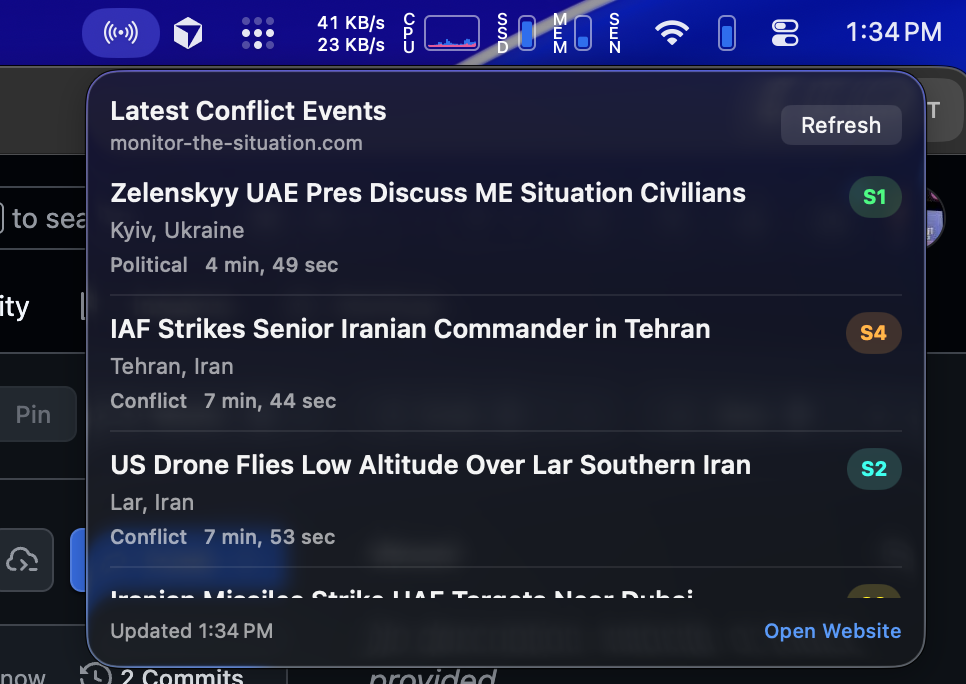

# ConflictMonitor

Small macOS menubar app built with Tuist that shows the latest events from:

- `https://monitor-the-situation.com/api/events`

## Requirements

- macOS 13+
- Tuist installed (`tuist version`)

## Run

```bash
./run-menubar.sh
```

The app runs as a menubar-only app (`LSUIElement = true`), so you will see its icon in the macOS menu bar.
Running `./run-menubar.sh` again will stop the current instance and relaunch it.

## Why not `tuist run`?

On this Tuist version (`4.50.2`), `tuist run` can fail to resolve a macOS destination and only list iOS simulators.
The app itself builds and runs correctly; `run-menubar.sh` is a reliable Tuist-based workaround.
